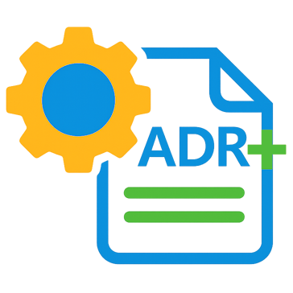

<div align="center">
  

  # AdrPlus.Abstractions
</div>

The plugin contract for [AdrPlus](https://www.nuget.org/packages/AdrPlus), a .NET CLI tool for
managing Architecture Decision Records (ADRs). Reference this package to write a plugin that
reacts to ADR lifecycle events (created, approved, rejected, superseded, etc.) without depending
on the AdrPlus source tree.

## Minimal example

```csharp
using AdrPlus.Abstractions;

public sealed class MyPlugin : IAdrPlugin
{
    public string Name => "MyPlugin";
    public string Version => "1.0.0";

    public Task InitializeAsync(IPluginContext context, IPluginConfiguration config, CancellationToken ct) =>
        Task.CompletedTask;

    public bool ShouldHandle(AdrEventContext context) => true;

    public Task<PluginResult> OnAdrEventAsync(AdrEventContext context, CancellationToken ct)
    {
        // React to context.EventType / context.Adr / context.GetAdrRenderedContent() here.
        return Task.FromResult(new PluginResult { Status = PluginResultStatus.Success });
    }

    public ValueTask DisposeAsync()
    {
        GC.SuppressFinalize(this);
        return ValueTask.CompletedTask;
    }
}
```

`AdrPluginBase` (also in this package) can help if you'd rather not repeat the exception-shielding
boilerplate `OnAdrEventAsync` needs across several plugins — it's entirely optional, see the full
guide below for that variant.

Drop the compiled plugin, its `plugin.json` manifest, and dependencies into a subfolder under the
target repository's `./plugins/<name>/` — AdrPlus discovers and loads it automatically.

## Full guide

For which events to subscribe to, retry/timeout semantics, the `ExternalKey`/`adrKey` identity
rules, and the manifest schema, see
[PluginDevelopmentGuide.md](https://github.com/FRACerqueira/AdrPlus/blob/main/PluginDevelopmentGuide.md)
in the main AdrPlus repository.
