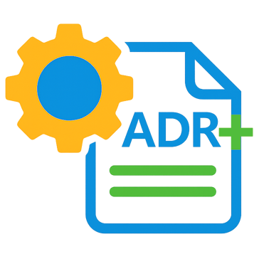

# AdrPlus

[](https://github.com/FRACerqueira/AdrPlus/actions/workflows/ci.yml)
[](https://www.nuget.org/packages/AdrPlus)
[](https://www.nuget.org/packages/AdrPlus)
[](LICENSE)
[](https://dotnet.microsoft.com)

[](./icon.png)

Many teams still document architectural decisions **inconsistently** (scattered Markdown files, no revision flow, and hard-to-track status changes).

AdrPlus was created to **solve this problem with a practical CLI workflow that keeps ADRs standardized, traceable, and easy to evolve over time**.

**AdrPlus** is a cross-platform .NET command-line tool for managing [Architecture Decision Records (ADRs)](https://adr.github.io/) directly from your terminal. 

It supports versioning, revision cycles, status workflows (approve / reject / undo), and an **interactive wizard** — all driven by a lightweight JSON configuration file.


---

## Table of Contents

- [Motivation and Benefits](#motivation-and-benefits)
- [Features](#features)
- [Requirements](#requirements)
- [Installation](#installation)
- [Quick Start](#quick-start)
- [Commands](#commands)
- [Rules for adr commands](#rules-by-adr-commands)
- [Suggested profiles](#suggested-settings-per-team-profile)
- [Configuration](#configuration)
- [Contributing](#contributing)
- [Code of Conduct](#code-of-conduct)
- [Security](#security)
- [License](#license)
- [Frequently Asked Questions](FAQ.md)
---

## Motivation and Benefits

Using **AdrPlus** in an engineering repository helps you:

- 📚 Keep architectural decisions organized with a predictable structure
- 🔍 Improve traceability with version, review, and supersede flows
- ⚡ Reduce manual effort when creating and updating ADR files
- 🤝 Improve collaboration by making decision history visible to the whole team
- 🚀 Accelerate onboarding by exposing context behind technical choices

---

## Features

- 📝 **Create** new ADRs with auto-incremented sequential numbers
- 🔢 **Version** and **review** existing ADRs (major version or revision bump)
- 🔄 **Supersede** an ADR by creating a successor with a new number
- ✅ **Approve** / ❌ **Reject** / ↩️ **Undo** ADR status changes
- 🧙 **Interactive wizard** for guided, step-by-step operations
- ⚙️ **Config editor** for application and repository settings
- 🌍 Multi-language support (`en-US`, `pt-BR`) for messages and UX
  - **ADR content can be written in any language!**
- 🖥️ Cross-platform (Windows, macOS, Linux)

---

## Requirements

### For running

- [.NET 8 Runtime](https://dotnet.microsoft.com/download/dotnet/8.0) or later

`AdrPlus` can be used in repositories of **any language or framework** (C#, Java, Node.js, Python, Go, etc.), because it manages ADR files in Markdown and does not depend on your application stack.

### For building and packaging from source

- [.NET 8 SDK](https://dotnet.microsoft.com/download/dotnet/8.0) 
- [.NET 9 SDK](https://dotnet.microsoft.com/download/dotnet/9.0)
- [.NET 10 SDK](https://dotnet.microsoft.com/download/dotnet/10.0)

---

## Installation

### Install from NuGet (Recommended for .NET developers)

The easiest way to install `AdrPlus` is directly from [NuGet.org](https://www.nuget.org/packages/AdrPlus):

```bash
dotnet tool install -g adrplus
```

To update to the latest version:

```bash
dotnet tool update -g adrplus
```

To uninstall:

```bash
dotnet tool uninstall -g adrplus
```

After installation, you can use `adrplus` from any terminal in any repository.

### Build and install from source

If you prefer to build from the repository source code:

#### 1. Build and generate a local package

```bash
# From repository root
dotnet restore
dotnet build -c Release
dotnet pack -c Release -o ./nupkg
```

#### 2. Install from local package

```bash
# Install as global tool from local package folder
dotnet tool install -g adrplus --add-source ./nupkg

# If already installed, update from the same local source
dotnet tool update -g adrplus --add-source ./nupkg
```

---

## Quick Start

```bash
# 1. Run the command wizard to configure and use the tool
adrplus wizard
```

---

## Manual Setup with the Wizard

```bash
# 1. Configure the tool (optional, you can edit the config file directly or use the config command later)

    # Configure application settings (language, prompts, defaults)
    adrplus config --application

    # Configure the base template used for new ADRs
    adrplus config --template

    # Configure repository settings (ADR naming, template, statuses, and structure)
    adrplus config --repository

# 2. Initialize a new ADR repository in the current directory
    
        adrplus init

# 3. Create your first ADR

    adrplus new

# 4. Approve it

    adrplus approve

# 5. List available commands

    adrplus help
```

---

## Individual Commands (without the wizard)

You can also execute commands directly, one by one, without the wizard and without interactive prompts.

```bash
# Configure the tool (optional, you can edit the config file directly or use the config command later)

    adrplus config --application --file "path/to/file-config"
    adrplus config --template --file "path/to/file-template.md"
    adrplus config --repository --file "path/to/file-config"

# Initialize ADR structure (only for the first time you set up the repository)

    adrplus init --path "path/to/repository"

# Create a new ADR directly

    adrplus new --title "Use PostgreSQL as primary database" --path "path/to/repository"

# Approve or reject a specific ADR file

    adrplus approve --file "./doc/adr/0001-use-postgresql.md"
    adrplus reject --file "./doc/adr/0002-legacy-cache.md"

# Create review/version/supersede flows

    adrplus review --file "./doc/adr/0001-use-postgresql.md"
    adrplus version --file "./doc/adr/0001-use-postgresql.md"
    adrplus supersede --file "./doc/adr/0001-use-postgresql.md"

# Undo last status change

    adrplus undo --file "./doc/adr/0001-use-postgresql.md"
```

Use `adrplus help <command>` to check the available parameters for each command.

---

## Commands

| Command     | Description                                                                  |
|-------------|------------------------------------------------------------------------------|
| `help`      | Display help information for all commands or a specific command              |
| `wizard`    | Launch the interactive wizard for guided operations                          |
| `config`    | Edit application and repository settings                                     |
| `init`      | Initialize the ADR repository folder structure                               |
| `new`       | Create a new ADR with an incremental number                                  |
| `version`   | Create a new major version of an accepted or rejected ADR (same number)      |
| `review`    | Create a new revision of an ADR (same number and version)                    |
| `supersede` | Supersede an ADR by creating a successor with a new incremental number       |
| `approve`   | Set an ADR status to *Accepted*                                               |
| `reject`    | Set an ADR status to *Rejected*                                               |
| `undo`      | Revert the last status change of an ADR                                      |

Run `adrplus help <command>` for detailed usage of any command.

### Rules by ADR commands

The rules below describe what must be true for a command to select its target successfully (especially in wizard mode).

> For file-based commands (`approve`, `reject`, `undo`, `version`, `review`, `supersede`), the file must exist, be a valid ADR `.md`, be under the configured `FolderRepo`, and the repository config file must be valid.

| Command | Successful selection rules |
|---|---|
| `new` | `title + domain` must be unique. When scope is enabled , `--scope` must be valid; `--domain` is required unless scope is listed in `skipdomain`. |
| `approve` | ADR must be eligible: not already approved/rejected and for the same sequence number not superseded.|
| `reject` | ADR must be eligible: not already approved/rejected.|
| `undo` | ADR must be eligible: already approved/rejected and for the same sequence not a superseded and not proposed.|
| `version` | ADR must be eligible: latest(or last approved and last rejected) ADR for the same sequence number approved/rejected and not superseded.|
| `review` | ADR must be eligible: latest(or last approved and last rejected) ADR for the same sequence number approved/rejected , not superseded and revision enabled.|
| `supersede` | ADR must be eligible: already approved and not superseded.|

---

## Configuration

AdrPlus uses two configuration files:

- `adrplus.json`: application-level settings (language, prompts, defaults).
- `adr-config.adrplus`: repository-level settings (ADR naming, template, statuses, and structure).

### `adrplus.json` example

You can edit the application configuration with:

```bash
adrplus config --application
```

```json
{
  "DefaultSettings": {
    "Language": "en-US",
    "YesValue": "",
    "NoValue": "",
    "FolderRepo": "doc/adr",
    "OpenAdr": "code {0}",
  }
}
```
| Key | Description |
|-----|-------------|
|`Language`| UI language/culture used by the tool (for example: `en-US`, `pt-BR`).|
|`YesValue`| Default confirmation value for positive responses.|
|`NoValue`| Default confirmation value for negative responses.|
|`OpenAdr`| Opens the ADR file after creation/update when supported.|

- VS Code users can set `OpenAdr` to `code {0}` to automatically open the created/updated ADR file in the editor.
- Visual Studio users can set `OpenAdr` to `devenv.exe {0}` to open the file in the associated application.
- For other IDEs/editors, adjust the command accordingly (for example: `rider {0}` to open in JetBrains Rider).
- If you prefer to keep it simple, set `OpenAdr` to an empty string `""` to disable automatic opening of ADR files.
- _**Note: the command must be available as a global PATH variable in the system to work properly.**_


### `adr-config.adrplus` example

AdrPlus uses the `adr-config.adrplus` file to control repository behavior, ADR naming, template content, and status labels.

You can edit it with:

```bash
adrplus config --repository
```

```json
{
  "folderrepo": "doc/adr",
  "dateformat": "",
  "template": "## Context\r\n\r\nDescribe the context and the problem to be solved.\r\n\r\n## Decision\r\n\r\nExplain the decision made.\r\n\r\n## Consequences\r\n\r\nList the impacts, benefits, and possible risks.\r\n\r\n## Alternatives Considered\r\n\r\n- Alternative 1 (Pros/Cons)\r\n- Alternative 2 (Pros/Cons)",
  "prefix": "ADR",
  "lenseq": 4,
  "lenversion": 2,
  "lenrevision": 0,
  "lenscope": 0,
  "separator": "-",
  "casetransform": "PascalCase",
  "statusnew": "Proposed",
  "statusacc": "Accepted",
  "statusrej": "Rejected",
  "statussup": "Superseded",
  "scopes": "",
  "folderbyscope": false,
  "skipdomain": "",
  "headerdisclaimer": "(Do not remove this template. It is required and must remain unchanged to ensure documentation consistency)",
  "headerstatus": "Status",
  "headerversion": "Version",
  "headerrevision": "Revision"
}
```

| Key | Description |
|-----|-------------|
| `folderrepo` | Relative path to the ADR repository folder (for example: `doc/adr`). |
| `dateformat` | Date format used in ADR metadata. If empty, default culture formatting is used. |
| `template` | Base Markdown template used when creating new ADR files (generated automatically; not editable). |
| `prefix` | Prefix used in ADR titles/identifiers (for example: `ADR`). |
| `lenseq` | Number of digits for the sequential ADR number (for example: `4` => `0001`). |
| `lenversion` | Number of digits for major version formatting (for example: `2` => `01`). |
| `lenrevision` | Number of digits for revision formatting (for example: `2` => `01`; `0` disables revision numbering). |
| `lenscope` | Maximum scope segment length used in generated names (when scope is enabled, value > 0). |
| `separator` | Separator character used in generated file names. |
| `casetransform` | Case style applied to generated name segments (for example: `PascalCase`). |
| `statusnew` | Label used for newly created ADRs. |
| `statusacc` | Label used for accepted ADRs. |
| `statusrej` | Label used for rejected ADRs. |
| `statussup` | Label used for superseded ADRs. |
| `scopes` | Allowed scopes list (can be empty when lenscope = 0). |
| `folderbyscope` | If `true`, ADR files are grouped by scope folders. |
| `skipdomain` | Optional terms from the list of scopes to be ignored in the generated nomenclature. |
| `headerdisclaimer` | Disclaimer header added to ADR template output. |
| `headerstatus` | Header label for ADR status field. |
| `headerversion` | Header label for ADR version field. |
| `headerrevision` | Header label for ADR revision field. |

### Suggested settings per team profile

#### 1) Monorepo (multiple apps/domains or enterprise architecture)

Use scopes and folder grouping to keep ADRs organized by area:

```json
{
  "folderrepo": "doc/adr",
  "scopes": "enterprise,project,backend,frontend,mobile,data",
  "skipdomain": "enterprise,project",
  "folderbyscope": true,
  "lenscope": 1,
  "separator": "-",
  "casetransform": "PascalCase"
}
```

#### 2) Simple repository

Use a simple flat structure with no scope folder split:

```json
{
  "folderrepo": "doc/adr",
  "scopes": "",
  "folderbyscope": false,
  "lenscope": 0,
  "separator": "-",
  "casetransform": "PascalCase"
}
```

#### 3) Product team with frequent revisions

Keep revision metadata visible and standardized:

```json
{
  "lenseq": 4,
  "lenversion": 2,
  "lenrevision": 2
}
```

> Tip: start with one profile, run `adrplus init`, create a test ADR with `adrplus new`, and adjust the config iteratively.

---

## Contributing

Contributions are welcome! Please read [CONTRIBUTING.md](CONTRIBUTING.md) before submitting pull requests or issues.

---

## Code of Conduct

Please read and follow [CODE_OF_CONDUCT.md](CODE_OF_CONDUCT.md).

---

## Security

To report a vulnerability, please read [SECURITY.md](SECURITY.md).

---

## License

This project is licensed under the [MIT License](LICENSE).

---